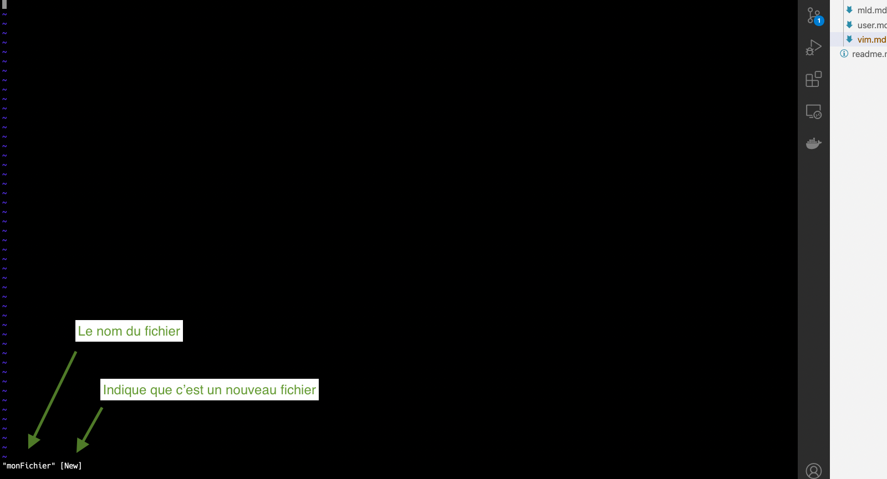
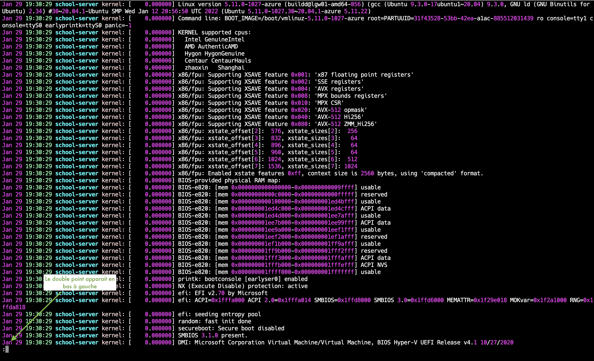
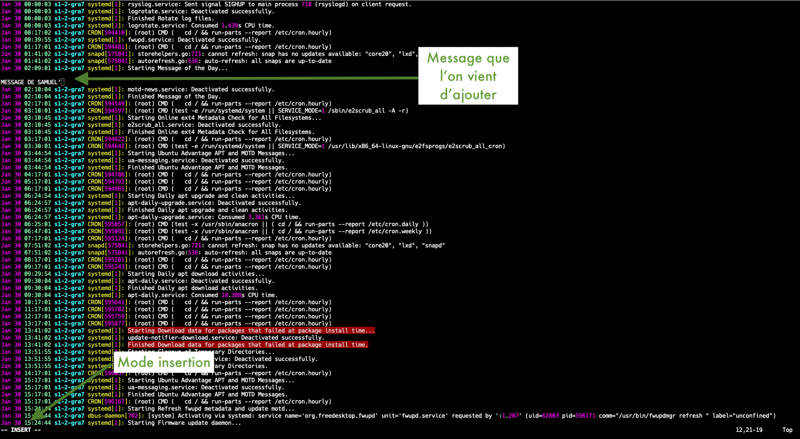

# Editeur de texte Vim

Lorsque vous vous connectez à un serveur, aucune interface graphique n'est présente, tout se fait en ligne de commande. Lors de la configuration de ce serveur, par exemple, il est possible que vous soyez amené à éditer un fichier et c'est là que Vim vient à la rescousse :laughing:
<br>
<br>
Vim est un éditeur de texte en ligne de commande, sa puissance repose sur le fait qu'il propose énormement de raccourcis clavier permettant de se passer de la souris.
<br>
<br>

Ci-dessous, nous allons s'intéresser aux bases de cet éditeur pour avoir une meilleure prise en main

## Comment ouvrir un fichier

Pour ouvrir un fichier avec Vim rien de plus simple, utilisez la commande `vim` suivi du nom du fichier à ouvrir 

```shell
ubuntu@ecole:~$  vim monFichier
```

:information_desk_person: Si le fichier que vous souhaitez ouvrir/éditer n'existe pas, **Vim** va ouvrir un fichier vide et l'enregistrera sur le disque au moment de la sauvegarde




1. Indique le nom du fichier que l'on souhaite éditer
2. Indique que le fichier ne peut pas être édité, on ne peut que le consulter
3. Indique la position de notre curseur

## Effectuer des actions dans Vim

En utilisant un éditeur de texte, vous allez être amené à effectuer différentes actions telles que quitter, sauvegarder, rechercher etc…

Pour indiquer à Vim que vous souhaitez effectuer une action, vous allez devoir utiliser le **double point** **:**




Lorsque vous cliquez sur les doubles points, ils apparaissent en bas à gauche de l'écran, à ce moment là, il ne reste plus qu'a préciser l'action que vous souhaitez éffectuer

:information_desk_person: Si vous vous êtes trompés et que vous ne souhaitez pas effectuer une action, utilisez la touche **escape**


## Les différentes façon de quitter l'éditeur

- Si vous souhaitez quitter le fichier et que vous n'y avez pas apporté de modification, vous pouvez simplement utiliser le **double point** + **q** (`:q`)

- Si vous avez effectué des modifications, deux choix s'offrent à vous.

    - Vous quittez le fichier sans enregistrer les modifications alors vous allez utilisez le `:q!`, le `!` permet de forcer l'action, on sait qu'il y a des changements mais on ne souhaite pas les prendre en compte
    - Vous quittez le fichier en enregistrant les modifications `:x` ou `:wq` le `w` indique que vous sauvegardez le fichier et le `q` que vous le quittez. :warning: Respectez l'ordre des paramètres on sauvegarde avant de quitter (le `w` avant le `q`)


## Mode insertion

Maintenant que l'on sait comment quitter un fichier, nous allons voir comment insérer des informations dans le fichier que l'on édite. 
<br>
<br>
Il faut savoir que par défaut quand vous ouvez un fichier avec `vim` il est en mode **navigation** (que nous allons voir plus bas) et donc pour pouvoir ajouter des informations dans le fichier nous devons passer en mode **insertion** pour cela vous allez utilisez **i**  à ce moment là en bas à gauche vous devriez voir apparaître **-- INSERT --** ce qui signifie que vous pouvez ajouter des informations là où votre curseur se trouve




## navigation

Pour naviguer dans l'éditeur de texte vous avez deux possibilités

Soitla premières sont d'utiliser les touches directionnelles du clavier


## rechercher


## aller à une ligne

……


## Quelques Raccourcis clavier

Supprimer une ligne
supprimer un mot


## faire une rechercher et remplacer


## Editeur nano

Vous avez la possibilité 
